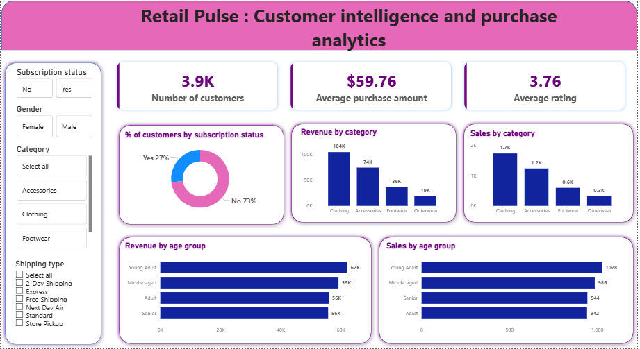

# RetailPulse-Customer-intelligence-and-Purchase-analytics
--- 
## Overview

This project uncovers insights into customer spending patterns, product preferences, discount behaviour, and subscription trends using a complete analytics pipeline: Python for data preparation, MySQL for business queries, and Power BI for visualization.

---

## Dataset

| Property    | Detail             |
|------------ |--------------------|
| Records     | 3,900 transactions |
| Features    | 18 columns         |
| Key fields  | Age, Gender, Category, Purchase Amount, Review Rating, Subscription Status, Shipping Type, Discount Applied, Previous Purchases |

---

##  Tools & Technologies

| Layer               | Tool            |
|---------------------|-----------------|
| Data Cleaning & EDA | Python (Pandas) |
| Database            | MySQL           |
| Visualization       | Power BI        |
| Reporting           | Google Docs     |
| Presentation        | Gamma           |

---

## Project Steps

**1. Data Cleaning & EDA — Python**
- Loaded dataset with Pandas
- Imputed missing `Review Rating` using category-wise median
- Renamed columns to snake_case
- Engineered `age_group` (quantile binning) and `purchase_frequency_days` (numeric mapping)
- Dropped redundant `promo_code_used` column (identical to `discount_applied`)
- Exported clean dataset to MySQL via SQLAlchemy

**2. Business Analysis — MySQL**

10 SQL queries answering key business questions:

| # | Question |
|---|---|
| Q1 | Revenue by gender |
| Q2 | High-spending discount users |
| Q3 | Top 5 products by review rating |
| Q4 | Standard vs Express shipping spend |
| Q5 | Subscribers vs non-subscribers spend |
| Q6 | Products with highest discount rates |
| Q7 | Customer segmentation (New / Returning / Loyal) |
| Q8 | Top 3 products per category |
| Q9 | Repeat buyers and subscription likelihood |
| Q10 | Revenue contribution by age group |

**3. Dashboard — Power BI**
- KPI cards: 3.9K customers · $59.76 avg purchase · 3.76 avg rating
- Charts: Revenue & sales by category, revenue & sales by age group
- Donut chart: Subscription breakdown (27% Yes / 73% No)
- Filters: Gender, Category, Subscription Status, Shipping Type

---

## Dashboard Preview



---

## Key Results

- **Male customers** generated 2× the revenue of female customers ($157K vs $75K)
- **Young Adults** are the highest revenue age group ($62K)
- **Clothing** leads in both revenue ($104K) and sales volume (1.7K units)
- **839 customers** used discounts yet spent above average , high value discount users
- **73% of customers are unsubscribed** , significant growth opportunity
- **80% of customers are Loyal** (11+ purchases), showing strong retention
- Repeat buyers (5+ purchases) skew heavily non-subscribed (2,518 vs 958) , a conversion gap

---

## Business Recommendations

- **Boost subscriptions** — target the 2,518 unsubscribed repeat buyers with exclusive perks
- **Protect margins** — Hat, Sneakers, and Coat have ~50% discount rates; review pricing strategy
- **Double down on Clothing** — highest revenue and volume across all categories
- **Focus on Young Adults** — top revenue segment; prioritise in campaign targeting

---

## Repository Structure

```
├── RetailPulse.ipynb          # Python EDA & cleaning
├── RetailPulse.sql            # MySQL business queries
├── Img_RetailPulse.png        # Power BI dashboard screenshot
├── Report_RetailPulse.pdf     # Full project report
└── README.md
```

---

## How to Run

**Python Notebook**
```
pip install pandas sqlalchemy mysql-connector-python
jupyter notebook RetailPulse_Customer_Intelligence_Portfolio.ipynb
```

**MySQL Queries**
```sql
-- Ensure MySQL is running and the database exists
CREATE DATABASE IF NOT EXISTS ;
-- Then run 
```

**Power BI Dashboard**
- Open the `.pbix` file in Power BI Desktop
- Refresh the data source connection to your MySQL instance

---

## 👤 Author
**Sharvari Mahalle**  
[LinkedIn](www.linkedin.com/in/sharvarimahalle)
